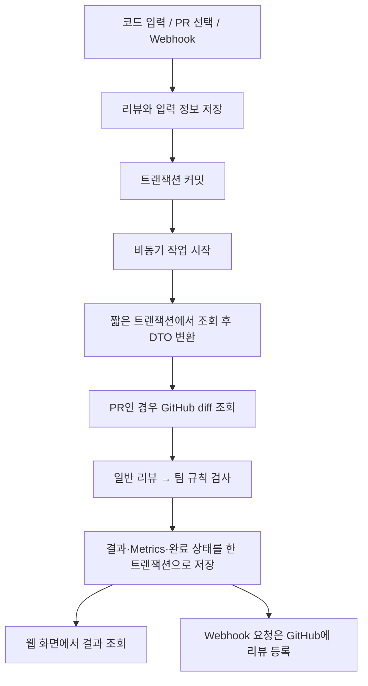

# 코리뷰어 (ReviewMate)

팀 규칙과 코드 품질을 함께 검사하는 AI 코드리뷰 서비스.

## 프로젝트 개요

| 항목 | 내용 |
| --- | --- |
| 개발 기간 | 2026.07.31 시작 (종료일 미확정) |
| 참여 인원 | 1명 |
| 담당 범위 | 기획, 데이터 모델·API 설계, 백엔드·프론트엔드 구현, AI 연동·비교 실험 |
| 개발 목적 | 팀 프로젝트에서 반복되는 컨벤션 확인과 1차 코드리뷰 지원 |
| 주요 기능 | 직접 입력 코드 리뷰, PR 리뷰, 팀 규칙 검사, GitHub Webhook 자동 리뷰 |
| Backend | Java 21, Spring Boot 4.0.7, Spring Data JPA, Spring Security, JWT |
| Frontend | React, JavaScript, Vite, React Router, Axios |
| Database | PostgreSQL |
| AI 연동 | Ollama, OpenAI API, JSON Schema 기반 응답 |
| 저장소 | [Backend](https://github.com/ham-zi/-Backend-CodeReviewer) · [Frontend](https://github.com/ham-zi/-Frontend-CodeReviewer) |

## 개발 배경

팀 프로젝트에서 같은 역할의 코드가 서로 다른 구조로 작성되고, 합의한 컨벤션도 일관되게 적용되지 않았다. 코드리뷰에서는 기능 오류뿐 아니라 계층 분리, 예외 처리, DTO 사용 방식까지 반복해서 확인해야 했다.

이를 줄이기 위해 일반 코드 리뷰와 팀 규칙 검사를 함께 제공하는 서비스를 만들었다. 사용자가 코드를 직접 입력하거나 PR을 선택하면 리뷰를 실행하고, GitHub Webhook으로 PR 변경 시 자동 리뷰도 수행한다.

## 주요 설계와 구현

### 1. 리뷰 입력과 실행 이력 분리

리뷰 1회 실행을 `ReviewEntity`로 관리하고, 입력 방식은 별도 엔티티로 분리했다.

| 데이터 | 역할 |
| --- | --- |
| Review | 리뷰 유형, 상태, 적용 규칙·프롬프트, 모델명, 원본 응답 |
| QuickSource | 사용자가 직접 입력한 코드 |
| PrSource | 리뷰할 PR 번호 |
| ReviewItem | 일반 코드 리뷰 결과 |
| RuleReviewItem | 팀 규칙 검사 결과 |
| Metrics | 입력·출력 토큰 수, AI 응답시간 |

QuickSource와 PrSource는 `@OneToOne + @MapsId`로 Review의 ID를 공유한다. 입력 방식이 달라도 실행 상태와 결과 처리 흐름을 재사용하도록 구성했다.

### 2. 비동기 리뷰와 트랜잭션 분리

Quick·PR 리뷰 요청을 저장한 뒤 리뷰 ID를 반환하고, AI 호출은 별도 스레드에서 실행한다.

- `ReviewService`: 요청 검증, 리뷰·입력 저장, 커밋 후 작업 호출
- `ReviewAsyncService`: 비동기 실행, 외부 호출 흐름, 실패 처리
- `TeamReviewProcessor`: 일반 리뷰와 규칙 검사 실행, 응답 파싱
- `ReviewTransactionService`: DTO 조회, 결과 저장, 상태 변경

GitHub와 AI 응답을 기다리는 동안 DB 트랜잭션을 유지하지 않도록 했다. 두 AI 응답을 받은 뒤 일반 결과, 규칙 결과, Metrics, 완료 상태를 함께 저장한다.

### 3. 일반 리뷰와 팀 규칙 검사 분리

일반 리뷰는 코드의 문제를 찾고, 팀 규칙 검사는 프로젝트에서 정한 기준의 준수 여부를 판단한다. 두 작업을 한 프롬프트에 넣었을 때 판단 기준이 섞이는 문제가 있어 호출을 분리했다.

- 일반 리뷰: 코드와 일반 리뷰용 시스템 프롬프트 전달
- 팀 규칙 검사: 같은 코드에 팀 규칙과 규칙 검사용 프롬프트 추가
- 결과: 각각 저장하고 하나의 리뷰 상세 화면에서 구분해 표시

두 번의 AI 호출이 필요하지만, 검사 목적과 결과를 따로 관리할 수 있게 했다.

### 4. 프롬프트 이력과 AI 연동 구조

프롬프트 버전 이력과 현재 적용 설정을 분리했다. 리뷰 생성 시 선택한 프롬프트와 팀 규칙을 Review에 연결하고, 비동기 실행에서도 해당 참조를 사용한다.

AI 통신은 `AiReviewClient` 인터페이스로 추상화했다. Ollama와 OpenAI 구현체는 공통 응답 DTO를 반환하며, 설정으로 사용할 구현체를 선택한다. 상위 리뷰 로직은 유지하면서 로컬 모델과 외부 API를 비교할 수 있도록 했다.

### 5. GitHub Webhook과 인라인 리뷰

PR의 `opened`, `reopened`, `synchronize` 이벤트를 받아 자동 리뷰를 시작한다.

- Webhook 서명을 HMAC-SHA256으로 검증
- Delivery ID와 프로젝트·PR 번호·head SHA로 기존 처리 여부 조회
- 실패한 Delivery가 재전송되면 재시도
- 리뷰 완료 후 GitHub 변경 코드 옆에 인라인 댓글 등록
- 전체 PR 댓글에는 위험·주의·권고별 건수와 항목명 요약

AI가 반환한 파일 경로와 시작 라인을 실제 diff의 추가 라인과 대조한다. 시작 라인부터 두 줄 뒤까지 유효한 위치를 찾고, 연결할 수 없는 항목은 요약에만 남긴다.

### 6. 리뷰 조회 화면

React 화면에서 프로젝트·팀 규칙 관리, Quick·PR 리뷰 요청, 이력 조회, 시스템 프롬프트 관리를 연결했다. 비동기 처리 상태는 polling으로 확인하고, 결과 화면에 일반 리뷰와 규칙 검사 결과, 토큰 수와 응답시간을 표시한다.

## 주요 문제 해결

### 커밋 전에 시작된 비동기 조회

**문제:** 리뷰를 저장하고 ID도 받았지만, 비동기 스레드에서는 ‘존재하지 않는 리뷰’ 예외가 발생했다.

**원인:** `save()` 직후 비동기 작업이 시작되면서 원래 트랜잭션의 커밋보다 조회가 먼저 실행될 수 있었다.

**해결:** `TransactionSynchronization.afterCommit()`에서 비동기 작업을 호출하도록 변경했다. 저장 순서와 다른 트랜잭션에서 조회 가능한 시점을 구분했다.

### 비동기 처리 중 LAZY 로딩 실패

**문제:** 비동기 작업에서 프로젝트나 시스템 프롬프트에 접근할 때 `LazyInitializationException`이 발생했다.

**원인:** 엔티티의 연관 데이터를 읽는 시점에 영속성 컨텍스트가 종료되어 있었다.

**해결:** 짧은 트랜잭션 안에서 필요한 값을 DTO로 추출했다. GitHub·AI 호출에서는 엔티티 대신 DTO를 사용하고, 결과 저장은 별도 트랜잭션에서 처리했다.

### 리뷰 본문이 길어 문제 위치를 찾기 어려움

**문제:** PR 댓글 하나에 코드, 설명, 수정안을 모아 출력하면서 코드가 반복되고 중요한 항목을 찾기 어려웠다.

**해결:** 리뷰를 코드 옆 인라인 댓글로 옮기고, 본문을 문제와 수정 방향 중심으로 줄였다. 전체 댓글에는 심각도별 요약을 남겼다. 파일·라인 검증을 추가해 실제 diff에 연결 가능한 위치만 사용했다.

## 로컬 LLM 비교 실험

2026년 8월 17일 개발 기록 기준으로 6개 모델을 비교했다. 같은 PC와 Ollama 환경에서 팀 규칙을 적용하지 않은 기본 코드리뷰를 수행했고, 탐지 여부뿐 아니라 오탐·미탐, 근거의 정확성, 반복 일관성, 생성 속도를 확인했다.

아래는 동일한 긴 코드 입력에 대한 기록이다.

| 항목 | qwen2.5-coder:32b | qwen3-coder:30b |
| --- | ---: | ---: |
| 입력 토큰 | 2,827 | 2,827 |
| 출력 토큰 | 838 | 750 |
| 생성 속도 | 1.7 tok/s | 21.8 tok/s |
| 생성 시간 | 479.21초 | 34.47초 |
| 전체 응답시간 | 521.33초 | 68.79초 |

해당 실험에서는 응답시간과 리뷰 품질을 함께 고려해 `qwen3-coder:30b`를 로컬 모델로 선정했다. 두 모델 모두 오탐과 미탐이 있어, AI 결과는 사람의 최종 판단을 돕는 1차 리뷰로 사용한다.

위 수치는 개발 당시 개별 실행 기록이며, 출력 길이도 다르다. 서비스 전체의 평균 성능이나 정확도 개선율을 의미하지 않는다.

## 검증 코드

저장소에는 다음 항목을 확인하는 단위 테스트가 있다.

- Webhook의 정상 서명, 변조된 payload, 잘못된 서명, 미설정 secret
- 여러 diff 구간의 추가 라인 계산과 최대 두 줄 위치 보정
- 인라인 댓글과 심각도별 요약 생성, 기존 응답 형식 호환
- AI 생성 문자열의 HTML 이스케이프

이 문서는 소스와 개발 기록을 대조해 작성했다. 테스트를 새로 실행하거나 운영 성능을 재측정한 결과는 아니다.

## 회고와 보완점

비동기 처리에서는 작업을 별도 스레드로 옮기는 것보다 커밋 시점과 트랜잭션 경계를 정하는 일이 중요했다. LLM은 응답 속도가 빠르거나 JSON 형식을 지킨다는 이유만으로 리뷰가 정확해지지 않아, 정상 코드의 오탐과 근거 코드도 함께 확인했다.

현재 PR 입력은 문자 수 상한을 넘으면 일부 diff를 생략한다. 파일별 분할 처리와 관련 코드 수집은 후속 과제다. 프롬프트 분리 전후의 정확도와 실제 리뷰 시간 절감 효과도 별도 측정이 필요하다.

## 참고 기록

- [기획 상세](https://app.notion.com/p/3ad5ae35342481019a6ac7eab8b47f98)
- [비동기 트랜잭션 문제 분석](https://app.notion.com/p/3ba5ae35342481039d97c084e616c1b6)
- [LAZY 로딩과 DTO 분리](https://app.notion.com/p/3b95ae35342481d48005d8e652918418)
- [QUICK 비동기화와 책임 분리](https://app.notion.com/p/3c55ae35342481f89a04fe1ca829b41d)
- [Team Review 구조 변경](https://app.notion.com/p/3c55ae35342481388102e894e8e1870f)
- [AI Provider 추상화](https://app.notion.com/p/3c55ae353424819ca92cea26b1f511af)
- [로컬 LLM 비교 결과](https://app.notion.com/p/3bf5ae35342481aa8860cc71e09e2260)
- [인라인 리뷰 설계](https://app.notion.com/p/3cd5ae35342481aaa8bdd1469f012a91)

Notion 기록은 접근 권한이 필요할 수 있다. 구현 설명은 2026-09-04에 확인한 Backend·Frontend 저장소의 main 기준이다.
