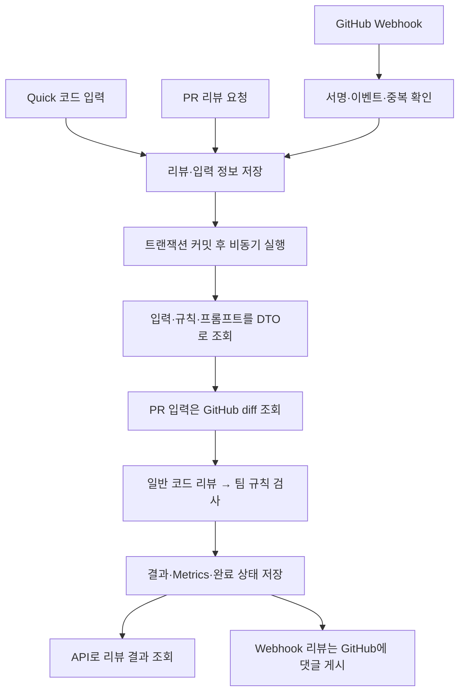

# 코리뷰어 · ReviewMate Backend

**코드 품질과 팀 규칙을 함께 확인하는 AI 코드리뷰 서비스의 백엔드입니다.**

코드를 직접 입력하거나 GitHub PR을 선택해 리뷰를 요청할 수 있습니다. GitHub Webhook을 연결하면 PR 생성·업데이트 시 자동으로 리뷰를 실행하고, 변경 코드 옆에 인라인 댓글과 전체 요약을 남깁니다.

[Frontend 저장소](https://github.com/ham-zi/-Frontend-CodeReviewer) · [설계·문제 해결·모델 비교 기록](./PORTFOLIO.md)

## 개발 배경

팀 프로젝트에서 코드리뷰를 할 때는 기능 오류뿐 아니라 계층 분리, 예외 처리, DTO 사용 방식 등 합의한 컨벤션도 반복해서 확인해야 합니다. ReviewMate는 이러한 1차 검토를 돕기 위해 일반 코드 리뷰와 팀 규칙 검사를 함께 제공합니다.

두 검사는 서로 다른 프롬프트로 실행하고 결과를 구분해 저장합니다. 코드 자체의 문제와 팀 기준의 준수 여부를 각각 확인할 수 있도록 구성했습니다.

## 주요 기능

| 기능 | 설명 |
| --- | --- |
| Quick 리뷰 | 직접 입력한 코드를 대상으로 일반 리뷰와 팀 규칙 검사 실행 |
| PR 리뷰 | 프로젝트에 연결된 GitHub 저장소의 열린 PR을 조회하고 변경 diff 리뷰 |
| Webhook 자동 리뷰 | PR 생성·재오픈·새 커밋 반영 시 비동기 리뷰 실행 |
| GitHub 리뷰 게시 | 변경 라인에 인라인 댓글 등록, PR Conversation에 위험·주의·권고 요약 게시 |
| 프로젝트·팀 관리 | GitHub 저장소 연결, 프로젝트 팀원 관리, 팀 규칙 등록·적용 |
| 프롬프트 관리 | 리뷰 유형별 시스템 프롬프트 이력과 현재 적용 설정 관리 |
| 리뷰 이력 조회 | 처리 상태, 일반 리뷰·규칙 검사 결과, 토큰 사용량과 AI 응답시간 조회 |
| AI Provider 선택 | 공통 인터페이스를 통해 Ollama 또는 OpenAI API 사용 |
| 사용자 인증 | 회원가입, JWT 로그인, 토큰 재발급·로그아웃 API 제공 |

## 기술 스택

| 구분 | 기술 |
| --- | --- |
| Language | Java 21 |
| Framework | Spring Boot 4.0.7 |
| Persistence | Spring Data JPA, PostgreSQL |
| Authentication | Spring Security, JWT (`jjwt` 0.13.0), BCrypt |
| AI | Ollama, OpenAI API, JSON Schema 기반 응답 |
| Integration | GitHub REST API, GitHub Webhook, Spring RestClient |
| Build / Test | Gradle Wrapper, JUnit, Spring Boot Test |

## 리뷰 처리 흐름



Quick·PR 요청 API는 리뷰 ID를 먼저 반환합니다. 클라이언트는 상세 조회 API로 `PENDING → PROCESSING → COMPLETED` 상태와 결과를 확인하며, 처리에 실패하면 `FAILED`로 기록됩니다.

### 설계 포인트

- **커밋 이후 작업 시작:** `TransactionSynchronization.afterCommit()`에서 비동기 작업을 호출해, 다른 스레드가 아직 커밋되지 않은 리뷰를 조회하는 문제를 방지합니다.
- **외부 호출과 트랜잭션 분리:** 필요한 데이터를 짧은 트랜잭션 안에서 DTO로 변환하고, GitHub·AI 호출은 트랜잭션 밖에서 수행합니다.
- **검사 목적 분리:** 일반 리뷰와 팀 규칙 검사를 별도의 AI 호출로 순서대로 실행합니다. 두 결과와 Metrics, 완료 상태는 하나의 트랜잭션으로 저장합니다.
- **실행 이력과 입력 분리:** `ReviewEntity`가 실행 상태를 관리하고, `QuickSourceEntity`·`PrSourceEntity`가 입력 정보를 관리합니다.
- **AI 구현 교체:** `AiReviewClient` 인터페이스와 공통 응답 DTO를 사용해 상위 리뷰 흐름을 유지하면서 Provider를 선택합니다.

구현 과정의 트랜잭션·LAZY 로딩 문제와 로컬 LLM 비교 내용은 [PORTFOLIO.md](./PORTFOLIO.md)에 정리했습니다.

## 프로젝트 구조

```text
src/main/java/com/reviewer/
├── ai/                 # AI 클라이언트 인터페이스와 공통 응답
├── auth/               # 로그인·토큰 재발급·로그아웃
├── common/             # JWT·토큰 저장·페이지 정보
├── configuration/      # Security·비동기·외부 서비스 설정
├── github/             # PR 조회와 Webhook 처리·리뷰 게시
├── ollama/             # Ollama 클라이언트
├── openai/             # OpenAI 클라이언트
├── project/            # 프로젝트·팀원·팀 규칙
├── review/             # 리뷰 요청·비동기 실행·결과·Metrics
├── system/             # 시스템 프롬프트와 적용 설정
├── user/               # 회원가입·사용자 데이터
├── api/                # 공통 API 응답
├── enums/              # 리뷰 유형·상태·역할
└── exception/          # 예외와 공통 예외 처리
```

## 로컬 실행 준비

### 1. 저장소 내려받기

```bash
git clone https://github.com/ham-zi/-Backend-CodeReviewer.git reviewmate-backend
cd reviewmate-backend
```

JDK 21, PostgreSQL, 사용할 AI Provider의 실행 환경 또는 API 키를 준비합니다. Gradle은 저장소에 포함된 Wrapper를 사용합니다.

> 현재 공개 저장소에는 `application.yml`과 `src/main/java/com/reviewer/system/model/Entity/SystemPromptEntity.java`가 포함되어 있지 않습니다. 해당 엔티티는 다른 클래스에서 참조하므로 빌드 전에 복원이 필요합니다. 설정·응답 스키마·초기 데이터도 준비해야 하며, 저장소를 내려받는 것만으로 바로 실행되는 상태는 아닙니다.

### 2. 애플리케이션 설정

`src/main/resources/application.yml`에 DB, JWT, AI, GitHub 설정을 작성합니다. 소스에서 사용하는 주요 설정 키는 다음과 같습니다.

| 설정 키 | 용도 |
| --- | --- |
| `spring.datasource.url` | PostgreSQL JDBC URL |
| `spring.datasource.username` / `password` | DB 접속 계정 |
| `spring.jpa.hibernate.ddl-auto` | 사용할 DB 스키마 관리 방식 |
| `jwt.secret` | Base64로 인코딩한 HMAC 서명 키 |
| `app.ai.provider` | `openai` 또는 `ollama` |
| `app.ai.format` | 리뷰 결과에 사용할 JSON Schema 문자열 |
| `app.openai.base-url` / `api-key` / `model` | OpenAI 접속 주소·키·모델 |
| `app.ollama.base-url` / `model` | Ollama 접속 주소·모델 |
| `app.ollama.num-ctx` / `temperature` / `stream` | Ollama 생성 옵션. 현재 응답 처리 방식에서는 `stream: false` 사용 |
| `github.token` | GitHub 저장소 조회·리뷰 게시용 토큰 |
| `github.webhook.secret` | Webhook 서명 검증용 Secret |
| `github.webhook.max-diff-characters` | PR diff 입력 길이 제한. 기본값 `120000` |

`app.ai.format`에는 `reviews` 배열과 항목별 `status`, `title`, `location`, `evidence`, `description`, `suggestion` 등의 구조가 필요합니다. 처리 과정에서 `filePath`·`startLine`과 결과 분류 enum을 스키마에 반영합니다. 임의의 JSON 문자열로 대체하지 말고 응답 파서에 맞는 스키마를 준비해야 합니다.

[.env.example](./.env.example)에 포함된 환경 변수 예시는 다음과 같습니다.

```dotenv
AI_PROVIDER=openai
OPENAI_API_KEY=replace-with-openai-api-key
OPENAI_MODEL=gpt-5.4

GITHUB_TOKEN=replace-with-github-token
GITHUB_WEBHOOK_SECRET=replace-with-a-long-random-secret
GITHUB_MAX_DIFF_CHARACTERS=120000
```

`.env` 파일의 자동 로딩은 저장소 코드에 구성되어 있지 않습니다. 실행 환경이나 IDE에 환경 변수를 등록하고, `application.yml`에서 `${AI_PROVIDER}`처럼 위 설정 키에 연결해야 합니다. 예를 들어 `app.ai.provider: ${AI_PROVIDER:ollama}`로 매핑합니다. 예시 모델명은 저장소의 설정 예시이며 고정된 필수 모델은 아닙니다.

### 3. 초기 데이터 준비

리뷰를 요청하기 전에 다음 데이터를 준비합니다.

1. 사용자 계정과 프로젝트를 생성하고 프로젝트 팀원을 등록합니다.
2. 프로젝트에 팀 규칙을 등록한 뒤 사용할 규칙을 적용합니다.
3. 사용할 리뷰 유형(`QUICK`, `PR`)에 일반 리뷰·규칙 검사 프롬프트를 등록하고 현재 설정에 연결합니다.
4. PR 리뷰를 사용할 프로젝트에는 GitHub owner와 repository 이름을 등록합니다.

### 4. 실행

위 소스·설정·DB 준비를 완료한 뒤 실행합니다.

```bash
# macOS / Linux
chmod +x gradlew
./gradlew bootRun
```

```powershell
# Windows PowerShell
.\gradlew.bat bootRun
```

## 주요 API

프로젝트·리뷰 요청 등 사용자 정보가 필요한 API에는 로그인으로 발급받은 `Authorization: Bearer <accessToken>`을 전달합니다.

| Method | Endpoint | 설명 |
| --- | --- | --- |
| POST | `/api/users` | 회원가입 |
| POST | `/api/auth/login` | 로그인 |
| POST | `/api/auth/refresh` | 토큰 재발급 |
| POST | `/api/auth/logout` | 로그아웃 |
| GET / POST | `/api/projects` | 프로젝트 목록 조회·생성 |
| GET | `/api/projects/{projectId}` | 프로젝트 상세 조회 |
| GET / POST | `/api/projects/{projectId}/members` | 팀원 조회·추가 |
| DELETE | `/api/projects/{projectId}/members/{projectMemberId}` | 팀원 삭제 |
| GET / POST | `/api/rules/{projectId}` | 팀 규칙 목록 조회·등록 |
| PATCH | `/api/projects/{projectId}/rule/{ruleId}` | 프로젝트 적용 규칙 변경 |
| GET | `/api/projects/{projectId}/git/pulls` | 열린 PR 목록 조회 |
| POST | `/api/reviews/quick` | 직접 입력 코드 리뷰 요청 |
| POST | `/api/reviews/pr` | PR 리뷰 요청 |
| GET | `/api/reviews` | 프로젝트·리뷰 유형별 이력 조회 |
| GET | `/api/reviews/{reviewId}` | 상태·리뷰 결과·Metrics 조회 |
| GET / POST | `/api/systems` | 시스템 프롬프트 목록 조회·등록 |
| PATCH | `/api/systems/setting` | 현재 사용할 시스템 프롬프트 변경 |
| POST | `/api/webhooks/github` | GitHub Webhook 수신 |

리뷰 목록 조회 예시: `/api/reviews?projectId=1&reviewType=PR&page=1`

## GitHub Webhook 연결

### 수신 이벤트

`pull_request` 이벤트 중 다음 action을 처리합니다.

| Action | 실행 시점 |
| --- | --- |
| `opened` | PR 생성 |
| `reopened` | PR 다시 열기 |
| `synchronize` | PR head 브랜치에 새 커밋 또는 force-push 반영 |

### 등록 방법

대상 GitHub 저장소의 **Settings → Webhooks → Add webhook**에서 설정합니다.

| 항목 | 값 |
| --- | --- |
| Payload URL | `https://YOUR_DOMAIN/api/webhooks/github` |
| Content type | `application/json` |
| Secret | 서버의 `github.webhook.secret`과 동일한 값 |
| Events | **Pull requests** |
| Active | 활성화 |

GitHub에서 접근할 수 있는 HTTPS 주소가 필요합니다. 로컬 개발에서는 터널링 도구 등으로 외부 주소를 연결합니다. 토큰에는 대상 저장소 접근 권한과 **Pull requests: Read and write** 권한을 부여합니다.

Webhook을 설치한 저장소의 owner/repository와 일치하는 프로젝트, 적용된 팀 규칙, 활성화된 PR 시스템 프롬프트가 있어야 합니다.

### 검증·중복 처리·결과 게시

- 원본 요청 body와 `X-Hub-Signature-256`을 HMAC-SHA256으로 검증합니다.
- Delivery ID와 프로젝트·PR 번호·head SHA를 조회해 이미 접수된 요청의 중복 실행을 제한합니다.
- 실패한 동일 Delivery가 재전송되면 재시도를 예약합니다.
- 미등록 저장소와 처리 대상이 아닌 이벤트·action은 무시합니다.
- AI가 지정한 파일·시작 라인을 실제 diff의 추가 라인과 대조합니다. 시작 라인부터 최대 두 줄 뒤까지 연결 가능한 위치를 확인합니다.
- 연결 가능한 항목은 인라인 댓글로 등록하고, 연결할 수 없는 항목은 전체 요약에 남깁니다. Conversation에는 위험·주의·권고별 건수와 항목명을 요약합니다.

## 테스트

```bash
./gradlew test
```

```powershell
.\gradlew.bat test
```

저장소에는 다음 검증 코드가 포함되어 있습니다.

- `GithubWebhookSignatureVerifierTest`: 정상 서명, payload 변조, 잘못된 서명, 미설정 Secret
- `GithubDiffLineResolverTest`: diff 추가 라인 계산과 위치 보정
- `GithubReviewCommentFormatterTest`: 인라인 댓글·요약 생성, 기존 응답 형식 호환, HTML 이스케이프
- `ReviewerApplicationTests`: Spring 애플리케이션 컨텍스트 로딩

테스트 실행에도 누락된 엔티티 복원이 필요하며, 컨텍스트 테스트에는 애플리케이션 설정과 DB 환경이 필요합니다. 위 목록은 저장소의 테스트 코드 기준이며 테스트 통과 결과를 의미하지 않습니다.

## 현재 범위와 개선 과제

- PR 리뷰는 GitHub가 제공한 diff를 대상으로 합니다. 바이너리 파일과 patch가 없는 파일은 제외되며, 입력 길이 제한을 넘으면 일부 내용이 생략됩니다.
- 파일별 분할 처리와 관련 코드 수집은 후속 개선 과제입니다.
- 일반 리뷰와 팀 규칙 검사는 순차적인 두 번의 AI 호출로 구성되어 응답시간과 토큰 사용량에 모두 영향을 줍니다.
- AI 리뷰에는 오탐·미탐이 있을 수 있습니다. 수정 여부는 근거 코드와 팀 기준을 확인한 뒤 판단합니다.

개발 배경, 문제 해결 과정, 모델 비교 실험의 조건과 한계는 [포트폴리오 문서](./PORTFOLIO.md)에서 확인할 수 있습니다.
