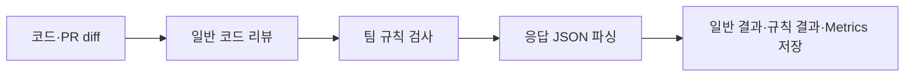
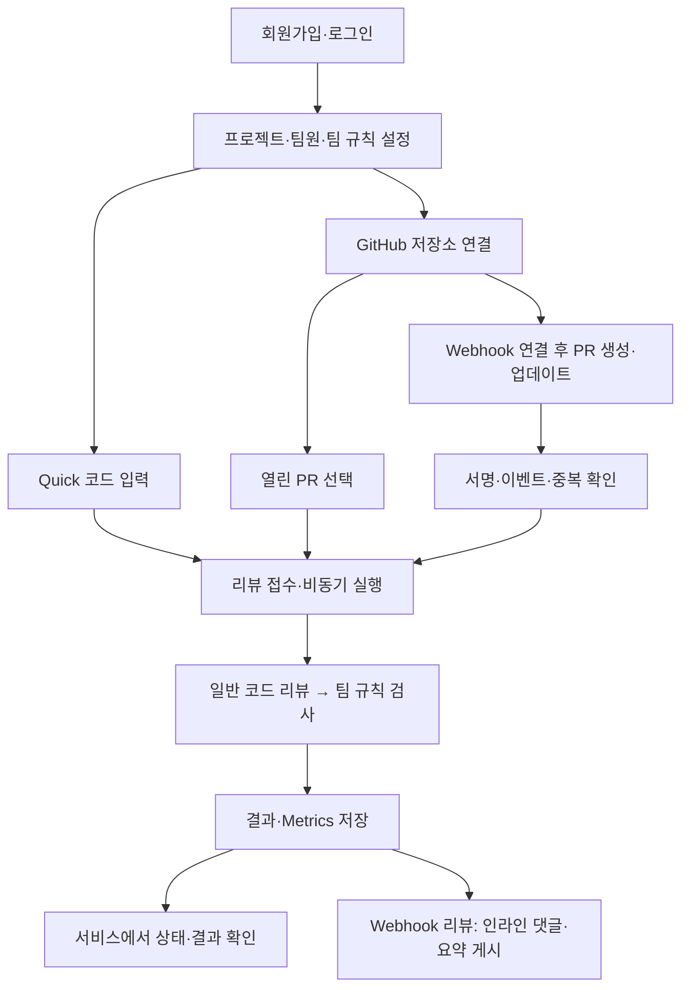
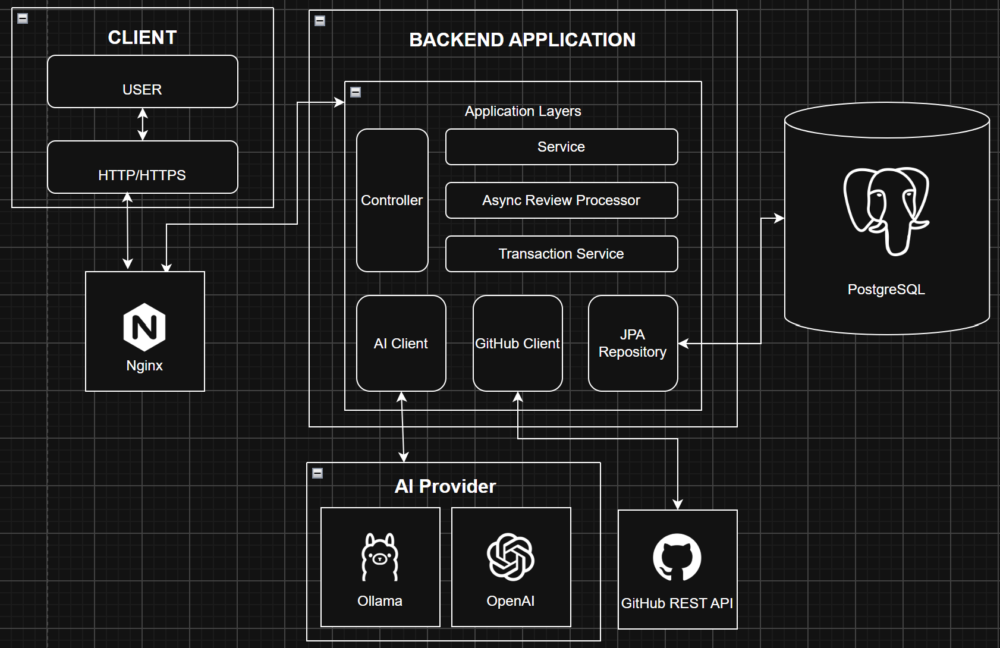
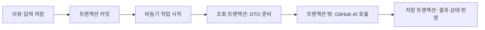
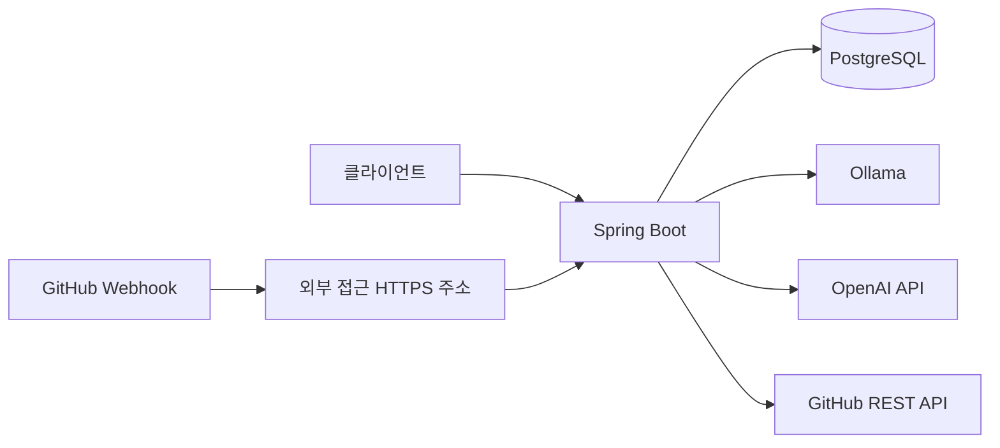

# ReviewMate Backend

> 코드 품질과 팀 규칙을 함께 확인하고, GitHub PR에 리뷰 결과를 연결하는 AI 코드리뷰 백엔드

<p align="center">
  <a href="https://github.com/ham-zi/-Frontend-CodeReviewer">
    
  </a>
  <a href="./TECHNICAL_DECISIONS.md">
    
  </a>
</p>

---

## 프로젝트 개요

ReviewMate는 코드를 직접 입력하거나 GitHub PR을 선택해 **일반 코드 리뷰와 팀 규칙 검사**를 함께 받을 수 있는 AI 코드리뷰 서비스입니다.

팀 프로젝트에서는 기능 오류뿐 아니라 계층 분리, 예외 처리, DTO 사용 방식처럼 합의한 컨벤션도 반복해서 확인해야 했습니다. ReviewMate는 사람이 PR을 검토하기 전에 이러한 항목을 확인하는 1차 리뷰를 돕기 위해 시작했습니다.

백엔드는 리뷰 요청과 비동기 실행, AI 응답 구조화, 프로젝트별 팀 규칙과 프롬프트 관리, GitHub Webhook 연동을 담당합니다. AI 결과를 실제 변경 라인의 인라인 댓글과 전체 요약으로 연결해, 개발자가 근거 코드와 수정 방향을 함께 확인할 수 있도록 했습니다.

| 항목 | 내용 |
| --- | --- |
| 프로젝트명 | ReviewMate · 코리뷰어 |
| 서비스 유형 | AI 기반 코드리뷰 및 팀 규칙 검사 |
| 리뷰 입력 | 직접 입력 코드(Quick), GitHub PR diff |
| AI 실행 환경 | Ollama 또는 OpenAI API 선택 |
| 관련 저장소 | [Frontend](https://github.com/ham-zi/-Frontend-CodeReviewer) |

---

## 기술 스택

<p align="center">
  
  
  
  
  
  
  
  
  
  
  
</p>

---

## 프로젝트 목표

- **해결하려던 문제**  
  팀 규칙을 사람이 반복해서 확인해야 하고, 코드리뷰 결과를 실제 변경 위치와 연결하는 데 시간이 들었습니다. AI를 도입한 뒤에도 오탐, 긴 응답시간, 일정하지 않은 출력 형식이 사용자 경험을 방해했습니다.

- **바꾸려던 사용자 경험**  
  코드를 입력하거나 PR을 생성하면 1차 리뷰가 실행되고, 코드 품질과 팀 규칙 결과를 구분해 확인하도록 했습니다. GitHub에서는 변경 라인 옆의 댓글과 위험·주의·권고 요약으로 검토할 내용을 찾을 수 있습니다.

- **이번 프로젝트에서 해결할 범위**  
  Quick·PR 리뷰, 일반 리뷰와 팀 규칙 검사의 분리, 비동기 처리와 상태 조회, AI Provider 선택, Webhook 검증과 결과 게시까지 구현했습니다. 전체 저장소 문맥 분석과 동일 지적의 지속적인 추적은 향후 과제로 구분했습니다.

---

## 주요 기능

### Quick·PR 코드 리뷰

직접 입력한 코드 또는 프로젝트에 연결된 GitHub 저장소의 열린 PR을 대상으로 리뷰합니다.  
요청 API는 리뷰 ID를 먼저 반환하고, 클라이언트는 상세 조회 API로 처리 상태와 결과를 확인합니다.

### 일반 리뷰·팀 규칙 검사

코드 자체의 문제를 찾는 일반 리뷰와 프로젝트에 등록한 팀 규칙 검사를 서로 다른 프롬프트로 순서대로 실행합니다.  
두 결과와 AI 원문을 구분해 저장하고, JSON Schema에 결과 분류와 파일·라인 정보를 반영합니다.


```mermaid
flowchart LR
    A["코드·PR diff"] --> B["일반 코드 리뷰"]
    B --> C["팀 규칙 검사"]
    C --> D["응답 JSON 파싱"]
    D --> E["일반 결과·규칙 결과·Metrics 저장"]
```

### GitHub Webhook 자동 리뷰

PR 생성·재오픈·새 커밋 반영 이벤트를 받으면 비동기 리뷰를 실행합니다.  
HMAC-SHA256 서명을 검증하고, Delivery ID와 프로젝트·PR 번호·head SHA로 중복 접수를 확인합니다. 실패한 동일 Delivery의 재전송은 재시도를 예약합니다.

### 인라인 댓글·PR 요약 갱신

AI가 반환한 파일과 시작 라인을 실제 diff의 추가 라인에 대조해 인라인 댓글을 게시합니다.  
연결할 수 없는 항목은 요약에 남기며, Conversation에는 위험·주의·권고별 건수와 항목명을 제공합니다.

PR 요약은 최초에 생성하고 이후 리뷰에서는 기존 댓글을 갱신합니다. 게시 직전 최신 Delivery 여부를 확인해 오래된 결과의 요약 게시를 건너뛰고, 기존 댓글이 삭제되어 404가 반환되면 새 댓글을 생성합니다. 동일 지적의 반복 인라인 댓글 방지는 아직 구현하지 않았습니다.

### 프로젝트·팀 규칙·프롬프트 관리

프로젝트에 GitHub 저장소와 팀원을 연결하고, 팀 규칙을 등록한 뒤 사용할 규칙을 선택합니다.  
리뷰 유형별 시스템 프롬프트를 등록·조회하고 현재 적용 설정을 변경할 수 있습니다.

### AI Provider·리뷰 이력

공통 `AiReviewClient` 인터페이스를 통해 Ollama 또는 OpenAI API를 선택합니다.  
리뷰별 처리 상태, 사용 모델, 일반·규칙 검사 결과, 입력·출력 토큰 수와 AI 응답시간을 조회합니다.

### 회원·인증

회원가입, JWT 로그인, 토큰 재발급과 로그아웃 API를 제공합니다.  
프로젝트·리뷰 조회와 요청에는 사용자 인증 및 프로젝트 구성원 검증을 적용합니다.

---

## 핵심 사용자 흐름

프로젝트와 팀 규칙 설정부터 리뷰 요청, 결과 확인, GitHub 검토까지를 하나의 흐름으로 연결했습니다.


```mermaid
flowchart TD
    A["회원가입·로그인"] --> B["프로젝트·팀원·팀 규칙 설정"]
    B --> C["Quick 코드 입력"]
    B --> D["GitHub 저장소 연결"]
    D --> E["열린 PR 선택"]
    D --> F["Webhook 연결 후 PR 생성·업데이트"]
    C --> G["리뷰 접수·비동기 실행"]
    E --> G
    F --> H["서명·이벤트·중복 확인"]
    H --> G
    G --> I["일반 코드 리뷰 → 팀 규칙 검사"]
    I --> J["결과·Metrics 저장"]
    J --> K["서비스에서 상태·결과 확인"]
    J --> L["Webhook 리뷰: 인라인 댓글·요약 게시"]
```

처리 상태는 `PENDING → PROCESSING → COMPLETED`로 전환되며, 리뷰 처리에 실패하면 `FAILED`로 기록됩니다. GitHub 게시 상태는 Webhook Delivery 이력으로 별도 관리합니다.

---

## 주요 API

핵심 사용자 흐름을 구성하는 대표 API입니다. 사용자 정보가 필요한 요청에는 로그인으로 발급받은 `Authorization: Bearer <accessToken>`을 전달합니다.

| 영역 | Method | Endpoint | 설명 |
| --- | --- | --- | --- |
| 회원 | POST | `/api/users` | 회원가입 |
| 인증 | POST | `/api/auth/login` | 로그인 |
| 인증 | POST | `/api/auth/refresh` | 토큰 재발급 |
| 인증 | POST | `/api/auth/logout` | 로그아웃 |
| 프로젝트 | GET / POST | `/api/projects` | 프로젝트 목록 조회·생성 |
| 프로젝트 | GET | `/api/projects/{projectId}` | 프로젝트 상세 조회 |
| 프로젝트 | GET / POST | `/api/projects/{projectId}/members` | 팀원 조회·추가 |
| 프로젝트 | DELETE | `/api/projects/{projectId}/members/{projectMemberId}` | 팀원 삭제 |
| 팀 규칙 | GET / POST | `/api/rules/{projectId}` | 팀 규칙 목록 조회·등록 |
| 팀 규칙 | PATCH | `/api/projects/{projectId}/rule/{ruleId}` | 프로젝트 적용 규칙 변경 |
| GitHub | GET | `/api/projects/{projectId}/git/pulls` | 열린 PR 목록 조회 |
| 리뷰 | POST | `/api/reviews/quick` | 직접 입력 코드 리뷰 요청 |
| 리뷰 | POST | `/api/reviews/pr` | PR 리뷰 요청 |
| 리뷰 | GET | `/api/reviews` | 프로젝트·리뷰 유형별 이력 조회 |
| 리뷰 | GET | `/api/reviews/{reviewId}` | 상태·리뷰 결과·Metrics 조회 |
| 프롬프트 | GET / POST | `/api/systems` | 시스템 프롬프트 목록 조회·등록 |
| 프롬프트 | PATCH | `/api/systems/setting` | 현재 사용할 시스템 프롬프트 변경 |
| Webhook | POST | `/api/webhooks/github` | GitHub Webhook 수신 |

리뷰 목록 조회 예시: `/api/reviews?projectId=1&reviewType=PR&page=1`

---

## 시스템 아키텍처

<p align="center">
  
</p>

Spring Boot 애플리케이션은 JPA Repository를 통해 PostgreSQL에 리뷰 상태와 결과를 저장합니다. 공통 AI Client 인터페이스로 Ollama 또는 OpenAI를 선택하고, GitHub Client로 PR diff 조회와 리뷰 게시를 처리합니다.

### 비동기 처리와 트랜잭션 경계

리뷰와 입력 정보를 저장한 트랜잭션이 커밋된 뒤 `afterCommit()`에서 비동기 작업을 시작합니다. 필요한 규칙과 프롬프트는 짧은 조회 트랜잭션에서 DTO로 옮기고, GitHub·AI 호출은 트랜잭션 밖에서 수행합니다. 일반 결과·규칙 결과·Metrics·완료 상태는 하나의 저장 트랜잭션으로 반영합니다.


```mermaid
flowchart LR
    A["리뷰·입력 저장"] --> B["트랜잭션 커밋"]
    B --> C["비동기 작업 시작"]
    C --> D["조회 트랜잭션: DTO 준비"]
    D --> E["트랜잭션 밖: GitHub·AI 호출"]
    E --> F["저장 트랜잭션: 결과·상태 반영"]
```

<details>
<summary>프로젝트 구조 보기</summary>

### 프로젝트 구조

```text
src/main/java/com/reviewer/
├── ai/                 # AI 클라이언트 인터페이스와 공통 응답
├── auth/               # 로그인·토큰 재발급·로그아웃
├── common/             # JWT·토큰 저장·페이지 정보
├── configuration/      # Security·비동기·외부 서비스 설정
├── github/             # PR 조회와 Webhook 처리·리뷰 게시
├── ollama/             # Ollama 클라이언트
├── openai/             # OpenAI 클라이언트
├── project/            # 프로젝트·팀원·팀 규칙
├── review/             # 리뷰 요청·비동기 실행·결과·Metrics
├── system/             # 시스템 프롬프트와 적용 설정
├── user/               # 회원가입·사용자 데이터
├── api/                # 공통 API 응답
├── enums/              # 리뷰 유형·상태·역할
└── exception/          # 예외와 공통 예외 처리
```


</details>

---

## 운영 아키텍처

Webhook 요청을 받는 외부 접근 주소, Spring Boot 서버, PostgreSQL, 선택한 AI Provider를 연결하는 구성입니다. 아래 그림은 구성 요소 간 통신 흐름을 나타냅니다.


```mermaid
flowchart LR
    U["클라이언트"] --> S["Spring Boot"]
    G["GitHub Webhook"] --> H["외부 접근 HTTPS 주소"]
    H --> S
    S --> DB[("PostgreSQL")]
    S --> O["Ollama"]
    S --> A["OpenAI API"]
    S --> API["GitHub REST API"]
```

### 리뷰 실행 지표

리뷰 상세 API에서 입력·출력 토큰 수와 AI 응답시간을 확인할 수 있습니다. 현재 저장소에는 별도의 모니터링 대시보드나 CI/CD 워크플로 설정이 포함되어 있지 않습니다.

### 실행 환경

JDK 21, PostgreSQL, AI Provider 설정과 GitHub 연동 정보를 준비해야 합니다. 현재 저장소에는 `application.yml`과 참조 대상인 `SystemPromptEntity.java`가 누락되어 있어, 소스 복원과 설정·초기 데이터 준비 후 빌드 및 실행해야 합니다.

<details>
<summary>로컬 실행 준비 및 설정 보기</summary>

### 로컬 실행 준비

#### 1. 저장소 내려받기

```bash
git clone https://github.com/ham-zi/-Backend-CodeReviewer.git reviewmate-backend
cd reviewmate-backend
```

JDK 21, PostgreSQL, 사용할 AI Provider의 실행 환경 또는 API 키를 준비합니다. Gradle은 저장소에 포함된 Wrapper를 사용합니다.

> 현재 공개 저장소에는 `application.yml`과 `src/main/java/com/reviewer/system/model/Entity/SystemPromptEntity.java`가 포함되어 있지 않습니다. 해당 엔티티는 다른 클래스에서 참조하므로 빌드 전에 복원이 필요합니다. 설정·응답 스키마·초기 데이터도 준비해야 하며, 저장소를 내려받는 것만으로 바로 실행되는 상태는 아닙니다.

#### 2. 애플리케이션 설정

`src/main/resources/application.yml`에 DB, JWT, AI, GitHub 설정을 작성합니다. 소스에서 사용하는 주요 설정 키는 다음과 같습니다.

| 설정 키 | 용도 |
| --- | --- |
| `spring.datasource.url` | PostgreSQL JDBC URL |
| `spring.datasource.username` / `password` | DB 접속 계정 |
| `spring.jpa.hibernate.ddl-auto` | 사용할 DB 스키마 관리 방식 |
| `jwt.secret` | Base64로 인코딩한 HMAC 서명 키 |
| `app.ai.provider` | `openai` 또는 `ollama` |
| `app.ai.format` | 리뷰 결과에 사용할 JSON Schema 문자열 |
| `app.openai.base-url` / `api-key` / `model` | OpenAI 접속 주소·키·모델 |
| `app.ollama.base-url` / `model` | Ollama 접속 주소·모델 |
| `app.ollama.num-ctx` / `temperature` / `stream` | Ollama 생성 옵션. 현재 응답 처리 방식에서는 `stream: false` 사용 |
| `github.token` | GitHub 저장소 조회·리뷰 게시용 토큰 |
| `github.webhook.secret` | Webhook 서명 검증용 Secret |
| `github.webhook.max-diff-characters` | PR diff 입력 길이 제한. 기본값 `120000` |

`app.ai.format`에는 `reviews` 배열과 항목별 `status`, `title`, `location`, `evidence`, `description`, `suggestion` 등의 구조가 필요합니다. 처리 과정에서 `filePath`·`startLine`과 결과 분류 enum을 스키마에 반영합니다. 임의의 JSON 문자열로 대체하지 말고 응답 파서에 맞는 스키마를 준비해야 합니다.

[.env.example](./.env.example)에 포함된 환경 변수 예시는 다음과 같습니다.

```dotenv
AI_PROVIDER=openai
OPENAI_API_KEY=replace-with-openai-api-key
OPENAI_MODEL=gpt-5.4

GITHUB_TOKEN=replace-with-github-token
GITHUB_WEBHOOK_SECRET=replace-with-a-long-random-secret
GITHUB_MAX_DIFF_CHARACTERS=120000
```

`.env` 파일의 자동 로딩은 저장소 코드에 구성되어 있지 않습니다. 실행 환경이나 IDE에 환경 변수를 등록하고, `application.yml`에서 `${AI_PROVIDER}`처럼 위 설정 키에 연결해야 합니다. 예를 들어 `app.ai.provider: ${AI_PROVIDER:ollama}`로 매핑합니다. 예시 모델명은 저장소의 설정 예시이며 고정된 필수 모델은 아닙니다.

#### 3. 초기 데이터 준비

리뷰를 요청하기 전에 다음 데이터를 준비합니다.

1. 사용자 계정과 프로젝트를 생성하고 프로젝트 팀원을 등록합니다.
2. 프로젝트에 팀 규칙을 등록한 뒤 사용할 규칙을 적용합니다.
3. 사용할 리뷰 유형(`QUICK`, `PR`)에 일반 리뷰·규칙 검사 프롬프트를 등록하고 현재 설정에 연결합니다.
4. PR 리뷰를 사용할 프로젝트에는 GitHub owner와 repository 이름을 등록합니다.

#### 4. 실행

위 소스·설정·DB 준비를 완료한 뒤 실행합니다.

```bash
# macOS / Linux
chmod +x gradlew
./gradlew bootRun
```

```powershell
# Windows PowerShell
.\gradlew.bat bootRun
```


</details>

<details>
<summary>GitHub Webhook 연결 방법 보기</summary>

### GitHub Webhook 연결

#### 수신 이벤트

`pull_request` 이벤트 중 다음 action을 처리합니다.

| Action | 실행 시점 |
| --- | --- |
| `opened` | PR 생성 |
| `reopened` | PR 다시 열기 |
| `synchronize` | PR head 브랜치에 새 커밋 또는 force-push 반영 |

#### 등록 방법

대상 GitHub 저장소의 **Settings → Webhooks → Add webhook**에서 설정합니다.

| 항목 | 값 |
| --- | --- |
| Payload URL | `https://YOUR_DOMAIN/api/webhooks/github` |
| Content type | `application/json` |
| Secret | 서버의 `github.webhook.secret`과 동일한 값 |
| Events | **Pull requests** |
| Active | 활성화 |

GitHub에서 접근할 수 있는 HTTPS 주소가 필요합니다. 로컬 개발에서는 터널링 도구 등으로 외부 주소를 연결합니다. 토큰에는 대상 저장소 접근 권한과 **Pull requests: Read and write** 권한을 부여합니다.

Webhook을 설치한 저장소의 owner/repository와 일치하는 프로젝트, 적용된 팀 규칙, 활성화된 PR 시스템 프롬프트가 있어야 합니다.

#### 검증·중복 처리·결과 게시

- 원본 요청 body와 `X-Hub-Signature-256`을 HMAC-SHA256으로 검증합니다.
- Delivery ID와 프로젝트·PR 번호·head SHA를 조회해 이미 접수된 요청의 중복 실행을 제한합니다.
- 실패한 동일 Delivery가 재전송되면 재시도를 예약합니다.
- PR별 요약 댓글은 최초 리뷰에서만 `POST`하고, 이후 push 리뷰에서는 DB에 저장된 기존 댓글 URL의 comment ID로 `PATCH`합니다.
- 이전 리뷰보다 최신 Webhook이 이미 접수된 경우 오래된 결과가 요약 댓글을 덮어쓰지 않도록 게시를 건너뜁니다.
- 기존 요약 댓글이 GitHub에서 직접 삭제되어 `PATCH`가 404를 반환하면 새 댓글을 생성하고 새 URL을 저장합니다.
- 미등록 저장소와 처리 대상이 아닌 이벤트·action은 무시합니다.
- AI가 지정한 파일·시작 라인을 실제 diff의 추가 라인과 대조합니다. 시작 라인부터 최대 두 줄 뒤까지 연결 가능한 위치를 확인합니다.
- 연결 가능한 항목은 인라인 댓글로 등록하고, 연결할 수 없는 항목은 전체 요약에 남깁니다. Conversation에는 위험·주의·권고별 건수와 항목명을 요약합니다.


</details>

---

## 데이터베이스 설계

리뷰 실행 상태, 입력 정보, 일반 리뷰 결과, 팀 규칙 결과를 분리하고 프로젝트와 연결합니다. 아래 표는 저장소 엔티티를 기준으로 정리한 주요 데이터 구조입니다.

| 영역 | 주요 엔티티 | 역할 |
| --- | --- | --- |
| 사용자·인증 | `UserEntity`, `TokenEntity` | 사용자 정보와 인증 토큰 관리 |
| 프로젝트 | `ProjectEntity`, `ProjectMemberEntity` | 저장소 연결과 프로젝트 구성원 관리 |
| 팀 규칙 | `ProjectRuleEntity` | 프로젝트 규칙과 적용 규칙 관리 |
| 리뷰 실행 | `ReviewEntity` | 리뷰 유형·상태·모델·일반 및 규칙 응답 원문 보관 |
| 리뷰 입력 | `QuickSourceEntity`, `PrSourceEntity` | 직접 입력 코드와 PR 번호 보관 |
| 리뷰 결과 | `ReviewItemEntity`, `RuleReviewItemEntity` | 일반 리뷰와 팀 규칙 검사 결과 분리 |
| 실행 지표 | `MetricsEntity` | 리뷰별 토큰 사용량과 AI 응답시간 관리 |
| Webhook 이력 | `GithubWebhookDeliveryEntity` | Delivery·head SHA·처리 상태·댓글 URL 관리 |
| 프롬프트 설정 | `SystemSettingEntity` | 리뷰 유형별 활성 프롬프트 참조 |

프롬프트 관련 코드는 `SystemPromptEntity`를 참조하지만 해당 소스는 현재 공개 저장소에 포함되어 있지 않습니다. 과거 Branch 리뷰 관련 엔티티도 남아 있으나, 현재 리뷰 요청 API는 Quick·PR 두 유형을 제공합니다.

---

## 테스트 및 품질 검증

### 백엔드 테스트

GitHub 연동의 서명 검증, diff 라인 해석, 댓글 생성과 요약 갱신을 검증하는 테스트가 포함되어 있습니다.

| 테스트 | 검증 내용 |
| --- | --- |
| `GithubWebhookSignatureVerifierTest` | 정상 서명, payload 변조, 잘못된 서명, 미설정 Secret |
| `GithubDiffLineResolverTest` | diff 추가 라인 계산과 위치 보정 |
| `GithubReviewCommentFormatterTest` | 인라인 댓글·요약 생성, 기존 응답 형식 호환, HTML 이스케이프 |
| `GithubPullRequestSummaryServiceTest` | 최초 요약 생성, 기존 댓글 갱신, 오래된 Delivery 게시 생략, 댓글 ID 추출 |
| `ReviewerApplicationTests` | Spring 애플리케이션 컨텍스트 로딩 |

```bash
./gradlew test
```

```powershell
.\gradlew.bat test
```

테스트 실행에는 누락된 엔티티 복원이 필요하며, 컨텍스트 테스트에는 애플리케이션 설정과 DB 환경도 필요합니다. 위 표는 저장소의 테스트 코드 기준이며 테스트 통과 결과를 의미하지 않습니다.

### 로컬 LLM 비교

개발 과정에서 로컬 모델 6종을 비교하며 문제 탐지뿐 아니라 정상 코드의 오탐, Evidence 정확도, 한국어·JSON 출력과 응답시간을 함께 확인했습니다.

동일한 2,827 input tokens의 긴 코드에 대한 개별 실행에서 `qwen2.5-coder:32b`의 총 응답시간은 521.33초, `qwen3-coder:30b`는 68.79초로 기록되었습니다. 당시 환경에서는 응답시간과 리뷰 품질의 균형을 기준으로 `qwen3-coder:30b`를 선택했습니다.

이 수치는 개발 기록의 개별 실행 결과이며, 반복 횟수와 하드웨어 조건을 통제한 통계적 벤치마크는 아닙니다. 실험 조건과 오탐 사례는 [기술 의사결정 기록](./TECHNICAL_DECISIONS.md)에 정리했습니다.

---

## 협업 및 개발 과정

팀 프로젝트의 반복적인 리뷰 작업을 출발점으로, 로컬 LLM 실험과 실제 연동 과정에서 확인한 문제를 구현에 반영했습니다. 기획·모델 비교·프롬프트 실험·트랜잭션 문제 해결 기록은 [기술 의사결정 기록](./TECHNICAL_DECISIONS.md)에서 확인할 수 있습니다.

| 단계 | 주요 작업 |
| --- | --- |
| 문제 정의 | 코드 품질과 팀 컨벤션의 반복 확인을 1차 리뷰 범위로 설정 |
| 모델·프롬프트 실험 | 로컬 모델 6종 비교, 정상 코드 오탐과 긴 입력 처리 한계 확인 |
| 응답 구조화 | JSON Schema 적용, AI 원문과 구조화 결과 분리 |
| 처리 구조 개선 | 커밋 이후 비동기 실행, DTO 조회와 외부 호출의 트랜잭션 분리 |
| AI 연동 분리 | `AiReviewClient` 기반 Ollama·OpenAI 구현 분리 |
| GitHub 연동 | PR diff 리뷰, Webhook 검증, 인라인 댓글과 요약 게시 |
| 결과 표시 개선 | PR 요약 댓글 재사용, 최신 Delivery 확인, 삭제된 댓글 재생성 |

---

## 프로젝트 결과

| 영역 | 결과 |
| --- | --- |
| 리뷰 입력 | 직접 입력 코드와 GitHub PR diff 리뷰 제공 |
| 검사 목적 분리 | 일반 코드 리뷰와 팀 규칙 검사를 별도 호출·결과로 관리 |
| 비동기 처리 | 리뷰 ID 선반환, 상태 조회, 커밋 이후 작업 실행 |
| AI 연동 | Ollama·OpenAI 공통 인터페이스와 응답 지표 관리 |
| GitHub 자동화 | PR 이벤트 기반 리뷰와 실제 변경 라인의 인라인 댓글 게시 |
| 요약 관리 | 기존 PR 요약 갱신, 오래된 결과 게시 생략, 삭제된 댓글 복구 |
| 품질 확인 | GitHub 연동 테스트와 로컬 모델 비교 기록 |

### 향후 과제

- 누락된 엔티티와 실행 설정 예시를 보완해 저장소만으로 빌드·실행 가능한 환경 구성
- 파일·hunk 단위 분할과 관련 코드 수집으로 diff 밖의 문맥 보강
- 동일 지적의 반복 인라인 댓글을 줄이기 위한 fingerprint와 해결 상태 추적
- 재시작 후 비동기 작업 복구와 여러 서버 인스턴스 간 PR별 게시 순서 보장
- 일반 리뷰와 규칙 검사의 순차 실행에 따른 지연시간·토큰 비용 개선

PR 리뷰는 GitHub가 patch를 제공하는 변경 코드를 대상으로 하며, 입력 길이 제한을 넘는 내용은 생략됩니다. AI 결과에는 오탐·미탐이 있을 수 있으므로 수정 여부는 근거 코드와 팀 기준을 확인한 뒤 판단합니다.

---

## 담당 역할

| 개발자 | 백엔드 구현 영역 | GitHub |
| --- | --- | --- |
| **ham-zi** | 리뷰 요청·비동기 처리, 팀 규칙·프롬프트 관리, AI Provider 연동, GitHub Webhook·댓글 게시, 인증·프로젝트 관리 | <a href="https://github.com/ham-zi"></a> |

---

<p align="center">
  <strong>코드의 근거와 팀의 기준을 함께 확인하는 1차 리뷰를 제공합니다.</strong>
</p>
